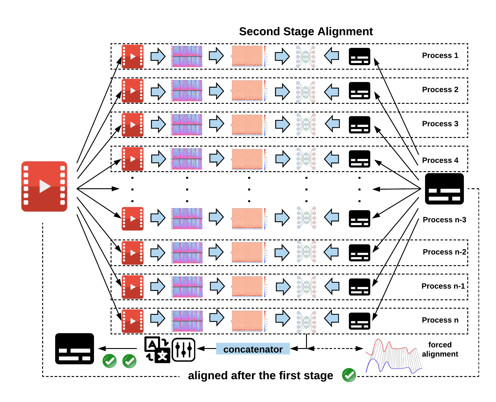

<div align="center">
  
</div>

[](https://github.com/baxtree/subaligner/actions/workflows/ci-pipeline.yml?query=branch%3Amaster) 
[](https://www.python.org/downloads/release/python-3100/) [](https://www.python.org/downloads/release/python-390/) [](https://www.python.org/downloads/release/python-380/)
[](https://subaligner.readthedocs.io/en/latest/?badge=latest)
[](https://github.com/baxtree/subaligner/blob/master/LICENSE)
[](https://badge.fury.io/py/subaligner)
[](https://hub.docker.com/r/baxtree/subaligner)
[](https://doi.org/10.5281/zenodo.5603083)

## Supported Formats
Subtitle: SubRip, TTML, WebVTT, (Advanced) SubStation Alpha, MicroDVD, MPL2, TMP, EBU STL, SAMI, SCC and SBV.

Video/Audio: MP4, WebM, Ogg, 3GP, FLV, MOV, Matroska, MPEG TS, WAV, MP3, AAC, FLAC, etc.

:information_source: <small style="line-height: 1.2;">Subaligner relies on file extensions as default hints to process a wide range of audiovisual or subtitle formats. It is recommended to use extensions widely acceppted by the community to ensure compatibility.</small>

## Dependencies
Required by basic: [FFmpeg](https://www.ffmpeg.org/)
```
$ apt-get install ffmpeg
```
or
```
$ brew install ffmpeg
```

## Basic Installation
```
$ pip install -U pip && pip install -U setuptools
$ pip install subaligner
```
or install from source:
```
$ git clone git@github.com:baxtree/subaligner.git && cd subaligner
$ pip install -U pip && pip install -U setuptools
$ python setup.py install
```
:information_source: <small style="line-height: 1.2;">It is highly recommended creating a virtual environment prior to installation.</small>

## Installation with Optional Packages Supporting Additional Features
```
# Install dependencies for enabling translation and transcription

$ pip install 'subaligner[llm]'
```
```
# Install dependencies for enabling forced alignment

$ pip install 'subaligner[stretch]'
```
```
# Install dependencies for setting up the development environment

$ pip install 'subaligner[dev]'
```
Note that both `subaligner[stretch]` and `subaligner[dev]` require additional dependencies to be pre-installed:
```
$ apt-get install espeak libespeak1 libespeak-dev espeak-data
```
or
```
$ brew install espeak
```
To install all supported features:
```
$ pip install 'subaligner[harmony]'
```

## Container Support
If you prefer using a containerised environment over installing everything locally, run:

```
$ docker run -v `pwd`:`pwd` -w `pwd` -it baxtree/subaligner bash
```
For users on Windows 10: [Docker Desktop](https://docs.docker.com/docker-for-windows/install/) is the only option at present.
Assuming your media assets are stored under `d:\media`, open built-in command prompt, PowerShell, or Windows Terminal and run:
```
docker pull baxtree/subaligner
docker run -v "/d/media":/media -w "/media" -it baxtree/subaligner bash
```

## Usage
```
# Single-stage alignment (high-level shift with lower latency)

$ subaligner -m single -v video.mp4 -s subtitle.srt
$ subaligner -m single -v https://example.com/video.mp4 -s https://example.com/subtitle.srt -o subtitle_aligned.srt
```
```
# Dual-stage alignment (low-level shift with higher latency)

$ subaligner -m dual -v video.mp4 -s subtitle.srt
$ subaligner -m dual -v https://example.com/video.mp4 -s https://example.com/subtitle.srt -o subtitle_aligned.srt
```
```
# Generate subtitles by transcribing audiovisual files
$ subaligner -m transcribe -v video.mp4 -ml eng -mr whisper -mf small -o subtitle_aligned.srt
$ subaligner -m transcribe -v video.mp4 -ml zho -mr whisper -mf medium -o subtitle_aligned.srt
```
```
# Alignment on segmented plain texts (double newlines as the delimiter)

$ subaligner -m script -v test.mp4 -s subtitle.txt -o subtitle_aligned.srt
$ subaligner -m script -v https://example.com/video.mp4 -s https://example.com/subtitle.txt -o subtitle_aligned.srt
```
```
# Alignment on multiple subtitles against the single media file

$ subaligner -m script -v test.mp4 -s subtitle_lang_1.txt -s subtitle_lang_2.txt
$ subaligner -m script -v test.mp4 -s subtitle_lang_1.txt subtitle_lang_2.txt
```
```
# Alignment on embedded subtitles

$ subaligner -m single -v video.mkv -s embedded:stream_index=0 -o subtitle_aligned.srt
$ subaligner -m dual -v video.mkv -s embedded:stream_index=0 -o subtitle_aligned.srt
```
```
# Translative alignment with the ISO 639-3 language code pair (src,tgt)

$ subaligner --languages
$ subaligner -m single -v video.mp4 -s subtitle.srt -t src,tgt
$ subaligner -m dual -v video.mp4 -s subtitle.srt -t src,tgt
$ subaligner -m script -v test.mp4 -s subtitle.txt -o subtitle_aligned.srt -t src,tgt
$ subaligner -m dual -v video.mp4 -tr helsinki-nlp -o subtitle_aligned.srt -t src,tgt
$ subaligner -m dual -v video.mp4 -tr facebook-mbart -tf large -o subtitle_aligned.srt -t src,tgt
$ subaligner -m dual -v video.mp4 -tr whisper -tf small -o subtitle_aligned.srt -t src,eng
```
```
# Transcribe audiovisual files and generate translated subtitles

$ subaligner -m transcribe -v video.mp4 -ml src -mr whisper -mf small -tr helsinki-nlp -o subtitle_aligned.srt -t src,tgt
```
```
# Shift subtitle manually by offset in seconds

$ subaligner -m shift --subtitle_path subtitle.srt -os 5.5
$ subaligner -m shift --subtitle_path subtitle.srt -os -5.5 -o subtitle_shifted.srt
```
```
# Run batch alignment against directories

$ subaligner_batch -m single -vd videos/ -sd subtitles/ -od aligned_subtitles/
$ subaligner_batch -m dual -vd videos/ -sd subtitles/ -od aligned_subtitles/
$ subaligner_batch -m dual -vd videos/ -sd subtitles/ -od aligned_subtitles/ -of ttml
```
```
# Run alignments with pipx

$ pipx run subaligner -m single -v video.mp4 -s subtitle.srt
$ pipx run subaligner -m dual -v video.mp4 -s subtitle.srt
```
```
# Run the module as a script
$ python -m subaligner -m single -v video.mp4 -s subtitle.srt
$ python -m subaligner -m dual -v video.mp4 -s subtitle.srt
```
```
# Run alignments with the docker image

$ docker pull baxtree/subaligner
$ docker run -v `pwd`:`pwd` -w `pwd` -it baxtree/subaligner subaligner -m single -v video.mp4 -s subtitle.srt
$ docker run -v `pwd`:`pwd` -w `pwd` -it baxtree/subaligner subaligner -m dual -v video.mp4 -s subtitle.srt
$ docker run -it baxtree/subaligner subaligner -m single -v https://example.com/video.mp4 -s https://example.com/subtitle.srt -o subtitle_aligned.srt
$ docker run -it baxtree/subaligner subaligner -m dual -v https://example.com/video.mp4 -s https://example.com/subtitle.srt -o subtitle_aligned.srt
```
The aligned subtitle will be saved at `subtitle_aligned.srt`. For details on CLIs, run `subaligner -h` or `subaligner_batch -h`, `subaligner_convert -h`, `subaligner_train -h` and `subaligner_tune -h` for additional utilities. `subaligner_1pass` and `subaligner_2pass` are shortcuts for running `subaligner` with `-m single` and `-m dual` options, respectively.


## Advanced Usage
You can train a new model with your own audiovisual files and subtitle files:
```
$ subaligner_train -vd VIDEO_DIRECTORY -sd SUBTITLE_DIRECTORY -tod TRAINING_OUTPUT_DIRECTORY
```
Then you can apply it to your subtitle synchronisation with the aforementioned commands. For more details on how to train and tune your own model, please refer to [Subaligner Docs](https://subaligner.readthedocs.io/en/latest/advanced_usage.html).

## Anatomy
Subtitles can be out of sync with their companion audiovisual media files for a variety of causes including latency introduced by Speech-To-Text on live streams or calibration and rectification involving human intervention during post-production.

A model has been trained with synchronised video and subtitle pairs and later used for predicating shifting offsets and directions under the guidance of a dual-stage aligning approach. 

First Stage (Global Alignment):


Second Stage (Parallelised Individual Alignment):


## Acknowledgement
This tool wouldn't be possible without the following packages:
[librosa](https://librosa.github.io/librosa/)
[tensorflow](https://www.tensorflow.org/)
[scikit-learn](https://scikit-learn.org)
[pycaption](https://pycaption.readthedocs.io)
[pysrt](https://github.com/byroot/pysrt)
[pysubs2](https://github.com/tkarabela/pysubs2)
[aeneas](https://www.readbeyond.it/aeneas/)
[transformers](https://huggingface.co/transformers/)
[openai-whisper](https://github.com/openai/whisper).

Thanks to Alan Robinson and Nigel Megitt for their invaluable feedback.
